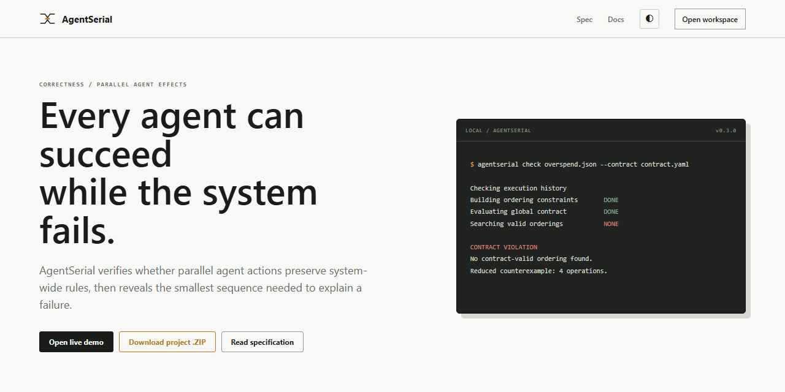

# AgentSerial

**When every agent succeeds and the system still fails.**

[](https://github.com/geragew/agentserial/actions/workflows/ci.yml)
[](https://www.python.org/)
[](LICENSE)
[](#why-agentserial)

AgentSerial is an open-source correctness checker for parallel AI-agent effect
histories. It verifies global contracts, finds schedule-dependent failures, and
reduces them to the smallest understandable counterexample. Everything runs
locally and deterministically, without an LLM, API key, or external service.



## Why AgentSerial?

Two agents can each report success while their combined effects break a budget,
duplicate a reservation, overwrite inventory, or violate another system-wide
rule. AgentSerial answers the question that individual task logs cannot:

> Did the system remain correct across every feasible ordering of those actions?

It imports JSONL or OpenTelemetry traces, replays feasible schedules against a
declarative contract, classifies the result, and generates an evidence report.

| Input | Analysis | Evidence |
| --- | --- | --- |
| JSON, JSONL, or OTLP/JSON | Deterministic replay of feasible schedules | Minimal counterexample and standalone HTML report |
| Explicit ordering constraints | Global invariant validation | Robust, schedule-dependent, or failing verdict |
| Local files only | No model or cloud dependency | Reproducible CLI output |

```text
Agent A: success
Agent B: success

Safe order:   credit -> debit
Unsafe order: debit -> credit

SCHEDULE_DEPENDENT
```

## Quick start

AgentSerial requires Python 3.11 or newer.

```console
python -m pip install -e ".[dev]"
agentserial --help
agentserial check examples/06_schedule_dependent/history.json --contract examples/06_schedule_dependent/contract.yaml
pytest
python scripts/export_schemas.py --check
python scripts/release_smoke.py
```

Try it immediately:

```console
agentserial demo
agentserial init my-agent-check
```

Convert an incremental trace from an existing runtime:

```console
agentserial import-jsonl events.jsonl --output history.json
agentserial import-otel traces.json --output history.json
agentserial validate history.json --contract contract.yaml
agentserial check history.json --contract contract.yaml
agentserial report history.json --contract contract.yaml --output report.html
```

## HTTP API

The optional HTTP API exposes the same deterministic checker used by the CLI.
Install and run it with:

```console
python -m pip install -e ".[api]"
agentserial serve
```

Open `http://127.0.0.1:8000/docs` for interactive OpenAPI documentation. The
service provides:

- `GET /health` for readiness checks.
- `POST /v1/validate` to validate a history and contract without replaying it.
- `POST /v1/check` to classify feasible execution orders and return evidence.
- `POST /v1/check-files` to upload JSON or YAML history and contract files.

Example request:

```console
curl -X POST http://127.0.0.1:8000/v1/check -H "Content-Type: application/json" --data @request.json
```

The request body contains `history` and `contract` objects using the same schemas
as the CLI, plus optional `max_operations` and `max_prefixes` limits. The API is
intended for trusted internal integrations. Operational controls are configured
through environment variables:

| Variable | Default | Purpose |
| --- | --- | --- |
| `AGENTSERIAL_API_KEY` | unset | Requires `X-AgentSerial-Key` on analysis routes when set |
| `AGENTSERIAL_MAX_BODY_BYTES` | `2000000` | Rejects oversized JSON and multipart bodies |
| `AGENTSERIAL_TIMEOUT_SECONDS` | `30` | Bounds request processing time |
| `AGENTSERIAL_RATE_LIMIT_PER_MINUTE` | `120` | Per-process client limit for analysis routes |
| `AGENTSERIAL_CORS_ORIGINS` | local origins | Comma-separated browser origins |

Run the hardened container locally:

```console
set AGENTSERIAL_API_KEY=replace-with-a-long-random-value
docker compose up --build
```

The JSONL event lifecycle and integration rules are documented in
[INTEGRATION.md](INTEGRATION.md).

OpenTelemetry users can import official OTLP/JSON trace exports using the
documented `agentserial.*` instrumentation convention in [OTEL.md](OTEL.md).

## Visual workspace

Open [index.html](index.html) directly in a browser for the interactive local
workspace. It includes Overview, History, Contract, Counterexample, Runs, and
Specification views with four consistent example histories.

Generated project media is under `media/`:

- `agentserial-demo.webm`: 12-second product walkthrough.
- `social-preview.png`: 1280x640 repository/social preview.
- `workspace-overview.png`: desktop analysis workspace.

The workspace includes a responsive inspection layout, light and dark themes,
four real examples, and a downloadable project bundle. It works directly from
`index.html`; no server or account is required.

With `agentserial serve` running, select **Analyze files** in the workspace to
submit real JSON or YAML documents to the local API. The browser displays the
verdict, replay counts, and reduced counterexample without terminal commands.

The visual system is explained in [DESIGN_RATIONALE.md](DESIGN_RATIONALE.md).

On PowerShell, place the command on one line or use PowerShell's backtick for
line continuation.

## Verdicts

- `ROBUST_PASS`: every feasible replay satisfies the contract.
- `SCHEDULE_DEPENDENT`: safe and unsafe feasible replays both exist.
- `CONTRACT_FAIL`: every feasible replay violates the contract.
- `INCONSISTENT_HISTORY`: no replay reproduces all recorded reads.
- `INCONCLUSIVE`: a declared search limit prevented classification.
- `INVALID_HISTORY` / `INVALID_CONTRACT`: input validation failed.

A feasible replay is a total order compatible with explicit order constraints
that reproduces each recorded value and resource version. See [SPEC.md](SPEC.md)
for the normative semantics and [DESIGN.md](DESIGN.md) for implementation choices.

## Current scope

v0.1 models atomic successful operations, exact reads, deterministic `set`,
`increment`, and `append` effects, and four invariant types: `max_sum`,
`min_value`, `unique`, and `equals`. Exhaustive replay is intentionally limited
to small histories.

It does not model irreversible external effects, partial commits, clock
uncertainty, capability revocation, or hidden state. A result is only as complete
as its instrumentation boundary.

## Why

Multi-agent runtimes increasingly execute work in parallel, but local task
success is not a global correctness property. AgentSerial is a runtime-neutral
checker for the recorded composition of effects, not an orchestrator or an agent
framework.

## Project status

AgentSerial is an early open-source release (`v0.3.0`) intended for research,
experimentation, and feedback. The current checker is fully tested within the
scope described above, but it is not yet a substitute for production transaction
controls or formal verification.

## Runtime recording

The thread-safe recorder produces the versioned JSONL lifecycle directly from an
agent runtime:

```python
from agentserial.recorder import TraceRecorder

recorder = TraceRecorder("events.jsonl", "run-42", {"budget": (1000, 0)})
with recorder.operation("purchase-a", "buyer-agent") as operation:
    operation.read("budget", 1000, 0)
    operation.effect("increment", "budget", -800)
```

Import the result with `agentserial import-jsonl events.jsonl`. Failed context
blocks are recorded as failed operations and buffered effects are discarded.

## Author

Created by **GERAGEW**.

- [GitHub](https://github.com/geragew)
- [LinkedIn](https://www.linkedin.com/in/geragew)
- [GERAGEW@ICLOUD.COM](mailto:GERAGEW@ICLOUD.COM)

## License and attribution

Copyright (c) 2026 **GERAGEW**. AgentSerial is available under the MIT License,
so commercial and private use, modification, and redistribution are permitted.
Redistributed copies or substantial portions of the software must retain the
copyright notice and MIT permission notice in [LICENSE](LICENSE). See
[NOTICE](NOTICE) for the project attribution record.

## Research and prior art

AgentSerial does not claim to invent serializability for agents. Related work and
the project's narrower positioning are documented in [PRIOR_ART.md](PRIOR_ART.md).
